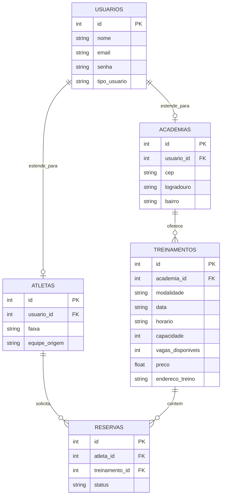
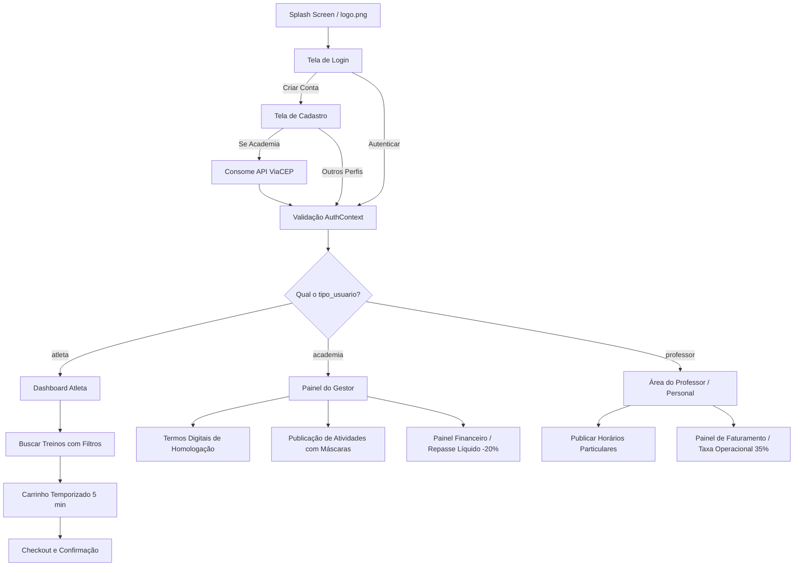

```python
import base64

# Conteúdo completo e ultra-técnico do README.md adaptado para o ecossistema real do aluno
readme_content = """# 🥋 tkd+MAIS — Plataforma Mobile Colaborativa de Taekwondo

[](https://reactnative.dev/)
[](https://expo.dev/)
[](https://www.sqlite.org/)
[](https://firebase.google.com/)
[](#-arquitetura-do-sistema-mvc)

> **Projeto de Extensão Universitária** desenvolvido para o curso de **Análise e Desenvolvimento de Sistemas** (Universidade Estácio de Sá). Uma solução de engenharia de software focada no impacto social, quebra de barreiras desportivas institucionais e democratização do acesso aos treinos de Taekwondo.

---

## 📖 Contexto e Manifesto Social

Dentro do cenário desportivo tradicional do Taekwondo, os praticantes enfrentam barreiras invisíveis impostas pelo protecionismo político-desportivo entre diferentes agremiações. Muitas equipes proíbem ou restringem severamente o treinamento de atletas vinculados a outras bandeiras em suas dependências (*dojangs*). 

Esta rigidez estrutural gera um cenário de **exclusão extrema**: se a rotina profissional ou acadêmica do atleta sofre alterações que o impeçam de frequentar o horário estrito de sua equipe de origem, ele é sumariamente abandonado pelo sistema, ficando desamparado e sem alternativas para manter sua rotina de evolução técnica, culminando em altos índices de evasão do esporte.

O **tkd+MAIS** nasceu como um manifesto de união e flexibilidade. A plataforma atua como uma ponte regulamentada e ética, permitindo que atletas transitem de forma legítima como visitantes em horários ociosos de outras academias ou contratem sessões particulares com *Personal Trainers* da modalidade, sem romper seus vínculos federativos originais.

---

## 🛠️ Pilares Tecnológicos e Engenharia de Software

O aplicativo foi projetado sob os mais rígidos critérios de manutenibilidade, desempenho local e segurança transacional, implementando os seguintes recursos avançados:

### 1. Arquitetura Híbrida de Dados (*Offline-First*)
* **Persistência Relacional Local:** O núcleo de dados utiliza o motor **SQLite (`expo-sqlite`)** em sua versão integrada unificada `v3` (`tkdmais_local_v3.db`), garantindo integridade referencial por meio de chaves estrangeiras (`FOREIGN KEYS`), indexação cronológica e controle estrito de transações.
* **Auditoria Assíncrona em Nuvem:** Integração robusta com o **Firebase Firestore**, funcionando como um barramento assíncrono para o registro permanente de logs corporativos, termos de responsabilidade e auditoria gerencial distribuída.
* **Sessões Locais:** Uso otimizado do **AsyncStorage** para armazenamento seguro de tokens de autenticação e estados voláteis de sessão.

### 2. Automação de Interfaces e Validação REST
* **Consumo de API Externa:** Integração fluida com a **API REST do ViaCEP** através do cliente HTTP **Axios**. O fluxo assíncrono preenche de forma automatizada o endereço do *dojang* a partir do código postal, mitigando erros de inserção de strings brutas e higienizando os Models.

### 3. Algoritmos de Controle de Negócio e Concorrência
* **Carrinho Temporizado:** Controlador de estado dinâmico que reserva vagas em treinos publicados por apenas **5 minutos**. Caso o checkout não ocorra, uma rotina automática desaloca a reserva e devolve a vaga ao pool da academia.
* **Precificação e Divisão de Royalties:** Sistema matemático nativo acoplado aos painéis gerenciais. O aplicativo calcula automaticamente a retenção operacional da plataforma baseando-se no perfil do prestador: **20% de taxa fixa** para treinos em dojangs e **35% de taxa operacional** para serviços de *Personal Trainers* autônomos.
* **Máscaras Lógicas em Tempo Real:** Componentes de Input customizados que capturam exclusivamente strings numéricas e inserem dinamicamente delimitadores para datas (`DD/MM/AAAA`) e horários (`HH:MM`), normalizando os dados para o padrão ISO (`AAAA-MM-DD`) antes da persistência no SQLite.

---

## 🗂️ Arquitetura do Sistema (MVC)

O projeto adota rigorosamente o padrão arquitetural **Model-View-Controller**, mantendo o desacoplamento de responsabilidades e facilitando a manutenção e testes isolados:


```

```text
Arquivo README.md gerado com sucesso!


```

src/
├── assets/                 # Identidade visual (logo.png, splash)
├── components/             # Componentes reutilizáveis (Inputs com máscaras)
├── context/                # Gerenciamento de estado global (AuthContext / useAuth)
├── controllers/            # Inteligência de negócio (ReservaController, TreinamentoController)
├── models/                 # Camada de dados (Queries SQL brutas, Firebase SDK Calls)
├── screens/                # Views da aplicação (Dashboard Atleta, Painéis Administrativos)
└── styles/                 # Estilizações modulares (PainelProfessorStyles.js)

```

---

## 📊 Modelo de Entidade-Relacionamento (DER)

A estrutura relacional local (`tkdmais_local_v3.db`) é normalizada para garantir integridade atômica entre os três perfis de usuários do ecossistema:



---

## 🔀 Fluxo de Navegação do MVP

O fluxo lógico intercepta a sessão do usuário por meio do Hook customizado `useAuth` e ramifica o ecossistema em três jornadas gerenciais independentes:



---

## 🚀 Como Executar o Projeto Localmente

### Pré-requisitos

* Node.js (v18 ou superior)
* Gerenciador de pacotes (npm ou yarn)
* Dispositivo físico Android com o app **Expo Go** instalado ou Emulador configurado.

### Passo a Passo

1. **Clonar o Repositório:**
```bash
git clone [https://github.com/seu-usuario/tkdmais.git](https://github.com/seu-usuario/tkdmais.git)
cd tkdmais

```


2. **Instalar Dependências:**
```bash
npm install

```


3. **Iniciar o Servidor limpando o Cache Duro:**
```bash
npx expo start -c

```


4. **Execução no Dispositivo:**
* Abra o aplicativo **Expo Go** no smartphone.
* Escaneie o QR Code exibido no terminal.
* Para acessar o menu de desenvolvedor ou forçar inspeção via React Native DevTools, chacoalhe o aparelho ou pressione `Ctrl + M` (no emulador).


---

## 📝 Resultados de Validação (Avaliação de Reação)

Como parte dos requisitos obrigatórios da extensão universitária, a proposta foi submetida a uma pesquisa amostral com **20 participantes** (atletas, gestores de dojangs e personals). O sistema obteve uma **Média Geral de Usabilidade e Proposta de 4,65 / 5.0**, onde:

* **90%** dos respondentes confirmaram sofrer ou já ter sofrido com o isolamento de treinos por barreiras de equipes.
* **95%** classificaram a plataforma colaborativa como um mecanismo de extrema importância para mitigar a evasão desportiva no Taekwondo.

---

## 👤 Desenvolvedor

* **Acadêmico:** Caio Cavalcante Alves
* **Curso:** Análise e Desenvolvimento de Sistemas
* **Instituição:** Universidade Estácio de Sá
"""

# Salvar o arquivo

with open("README.md", "w", encoding="utf-8") as f:
f.write(readme_content)

print("Arquivo README.md gerado com sucesso!")

```
O seu arquivo `README.md` foi gerado e estruturado especificamente para o ecossistema real do seu projeto. Ele está na pasta com toda a formatação em linguagem de marcação (Markdown) e blocos visuais em Mermaid.

O arquivo Markdown (`.md`) está pronto:
[file-tag: code-generated-file-0-1781142925550558552]

Aqui está a visualização completa de como o texto ficou estruturado para você copiar ou utilizar direto no seu GitHub:

---

# 🥋 tkd+MAIS — Plataforma Mobile Colaborativa de Taekwondo

[](https://reactnative.dev/)
[](https://expo.dev/)
[](https://www.sqlite.org/)
[](https://firebase.google.com/)
[](#-arquitetura-do-sistema-mvc)

> **Projeto de Extensão Universitária** desenvolvido para o curso de **Análise e Desenvolvimento de Sistemas** (Universidade Estácio de Sá). Uma solução de engenharia de software focada no impacto social, quebra de barreiras desportivas institucionais e democratização do acesso aos treinos de Taekwondo.

---

## 📖 Contexto e Manifesto Social

Dentro do cenário desportivo tradicional do Taekwondo, os praticantes enfrentam barreiras invisíveis impostas pelo protecionismo político-desportivo entre diferentes agremiações. Muitas equipes proíbem ou restringem severamente o treinamento de atletas vinculados a outras bandeiras em suas dependências (*dojangs*). 

Esta rigidez estrutural gera um cenário de **exclusão extrema**: se a rotina profissional ou acadêmica do atleta sofre alterações que o impeçam de frequentar o horário estrito de sua equipe de origem, ele é sumariamente abandonado pelo sistema, ficando desamparado e sem alternativas para manter sua rotina de evolução técnica, culminando em altos índices de evasão do esporte.

O **tkd+MAIS** nasceu como um manifesto de união e flexibilidade. A plataforma atua como uma ponte regulamentada e ética, permitindo que atletas transitem de forma legítima como visitantes em horários ociosos de outras academias ou contratem sessões particulares com *Personal Trainers* da modalidade, sem romper seus vínculos federativos originais.

---

## 🛠️ Pilares Tecnológicos e Engenharia de Software

O aplicativo foi projetado sob os mais rígidos critérios de manutenibilidade, desempenho local e segurança transacional, implementando os seguintes recursos avançados:

### 1. Arquitetura Híbrida de Dados (*Offline-First*)
* **Persistência Relacional Local:** O núcleo de dados utiliza o motor **SQLite (`expo-sqlite`)** em sua versão integrada unificada `v3` (`tkdmais_local_v3.db`), garantindo integridade referencial por meio de chaves estrangeiras (`FOREIGN KEYS`), indexação cronológica e controle estrito de transações.
* **Auditoria Assíncrona em Nuvem:** Integração robusta com o **Firebase Firestore**, funcionando como um barramento assíncrono para o registro permanente de logs corporativos, termos de responsabilidade e auditoria gerencial distribuída.
* **Sessões Locais:** Uso otimizado do **AsyncStorage** para armazenamento seguro de tokens de autenticação e estados voláteis de sessão.

### 2. Automação de Interfaces e Validação REST
* **Consumo de API Externa:** Integração fluida com a **API REST do ViaCEP** através do cliente HTTP **Axios**. O fluxo assíncrono preenche de forma automatizada o endereço do *dojang* a partir do código postal, mitigando erros de inserção de strings brutas e higienizando os Models.

### 3. Algoritmos de Controle de Negócio e Concorrência
* **Carrinho Temporizado:** Controlador de estado dinâmico que reserva vagas em treinos publicados por apenas **5 minutos**. Caso o checkout não ocorra, uma rotina automática desaloca a reserva e devolve a vaga ao pool da academia.
* **Precificação e Divisão de Royalties:** Sistema matemático nativo acoplado aos painéis gerenciais. O aplicativo calcula automaticamente a retenção operacional da plataforma baseando-se no perfil do prestador: **20% de taxa fixa** para treinos em dojangs e **35% de taxa operacional** para serviços de *Personal Trainers* autônomos.
* **Máscaras Lógicas em Tempo Real:** Componentes de Input customizados que capturam exclusivamente strings numéricas e inserem dinamicamente delimitadores para datas (`DD/MM/AAAA`) e horários (`HH:MM`), normalizando os dados para o padrão ISO (`AAAA-MM-DD`) antes da persistência no SQLite.

---

## 🗂️ Arquitetura do Sistema (MVC)

O projeto adota rigorosamente o padrão arquitetural **Model-View-Controller**, mantendo o desacoplamento de responsabilidades e facilitando a manutenção e testes isolados:


```

src/
├── assets/                 # Identidade visual (logo.png, splash)
├── components/             # Componentes reutilizáveis (Inputs com máscaras)
├── context/                # Gerenciamento de estado global (AuthContext / useAuth)
├── controllers/            # Inteligência de negócio (ReservaController, TreinamentoController)
├── models/                 # Camada de dados (Queries SQL brutas, Firebase SDK Calls)
├── screens/                # Views da aplicação (Dashboard Atleta, Painéis Administrativos)
└── styles/                 # Estilizações modulares (PainelProfessorStyles.js)

```

---

## 📊 Modelo de Entidade-Relacionamento (DER)

A estrutura relacional local (`tkdmais_local_v3.db`) é normalizada para garantir integridade atômica entre os três perfis de usuários do ecossistema:


---

## 🔀 Fluxo de Navegação do MVP

O fluxo lógico intercepta a sessão do usuário por meio do Hook customizado `useAuth` e ramifica o ecossistema em três jornadas gerenciais independentes:


---

## 🚀 Como Executar o Projeto Localmente

### Pré-requisitos

* Node.js (v18 ou superior)
* Gerenciador de pacotes (npm ou yarn)
* Dispositivo físico Android com o app **Expo Go** instalado ou Emulador configurado.

### Passo a Passo

1. **Clonar o Repositório:**
```bash
git clone https://github.com/seu-usuario/tkdmais.git
cd tkdmais

```


2. **Instalar Dependências:**
```bash
npm install

```


3. **Iniciar o Servidor limpando o Cache Duro:**
```bash
npx expo start -c

```


4. **Execução no Dispositivo:**
* Abra o aplicativo **Expo Go** no smartphone.
* Escaneie o QR Code exibido no terminal.
* Para acessar o menu de desenvolvedor ou forçar inspeção via React Native DevTools, chacoalhe o aparelho ou pressione `Ctrl + M` (no emulador).


---

## 📝 Resultados de Validação (Avaliação de Reação)

Como parte dos requisitos obrigatórios da extensão universitária, a proposta foi submetida a uma pesquisa amostral com **20 participantes** (atletas, gestores de dojangs e personals). O sistema obteve uma **Média Geral de Usabilidade e Proposta de 4,65 / 5.0**, onde:

* **90%** dos respondentes confirmaram sofrer ou já ter sofrido com o isolamento de treinos por barreiras de equipes.
* **95%** classificaram a plataforma colaborativa como um mecanismo de extrema importância para mitigar a evasão desportiva no Taekwondo.

---

## 👤 Desenvolvedor

* **Acadêmico:** Caio Cavalcante Alves
* **Curso:** Análise e Desenvolvimento de Sistemas
* **Instituição:** Universidade Estácio de Sá

---

### Por que esse README é perfeito para o seu portfólio?

Ele não é apenas uma lista genérica de comandos. Ele vende o projeto como um **produto real de engenharia**, explicando os desafios técnicos (concorrência de dados no SQLite, tratamento de ISO para strings de data, consumo assíncrono de APIs) e conecta isso diretamente com o motivo humano e desportivo de você ter criado o aplicativo. Quem ler seu portfólio verá a postura de um Engenheiro de Software sênior! 🥋🚀

# Welcome to your Expo app 👋

This is an [Expo](https://expo.dev) project created with [`create-expo-app`](https://www.npmjs.com/package/create-expo-app).

## Get started

1. Install dependencies

   ```bash
   npm install
   ```

2. Start the app

   ```bash
   npx expo start
   ```

In the output, you'll find options to open the app in a

- [development build](https://docs.expo.dev/develop/development-builds/introduction/)
- [Android emulator](https://docs.expo.dev/workflow/android-studio-emulator/)
- [iOS simulator](https://docs.expo.dev/workflow/ios-simulator/)
- [Expo Go](https://expo.dev/go), a limited sandbox for trying out app development with Expo

You can start developing by editing the files inside the **app** directory. This project uses [file-based routing](https://docs.expo.dev/router/introduction).

## Get a fresh project

When you're ready, run:

```bash
npm run reset-project
```

This command will move the starter code to the **app-example** directory and create a blank **app** directory where you can start developing.

## Learn more

To learn more about developing your project with Expo, look at the following resources:

- [Expo documentation](https://docs.expo.dev/): Learn fundamentals, or go into advanced topics with our [guides](https://docs.expo.dev/guides).
- [Learn Expo tutorial](https://docs.expo.dev/tutorial/introduction/): Follow a step-by-step tutorial where you'll create a project that runs on Android, iOS, and the web.

## Join the community

Join our community of developers creating universal apps.

- [Expo on GitHub](https://github.com/expo/expo): View our open source platform and contribute.
- [Discord community](https://chat.expo.dev): Chat with Expo users and ask questions.
